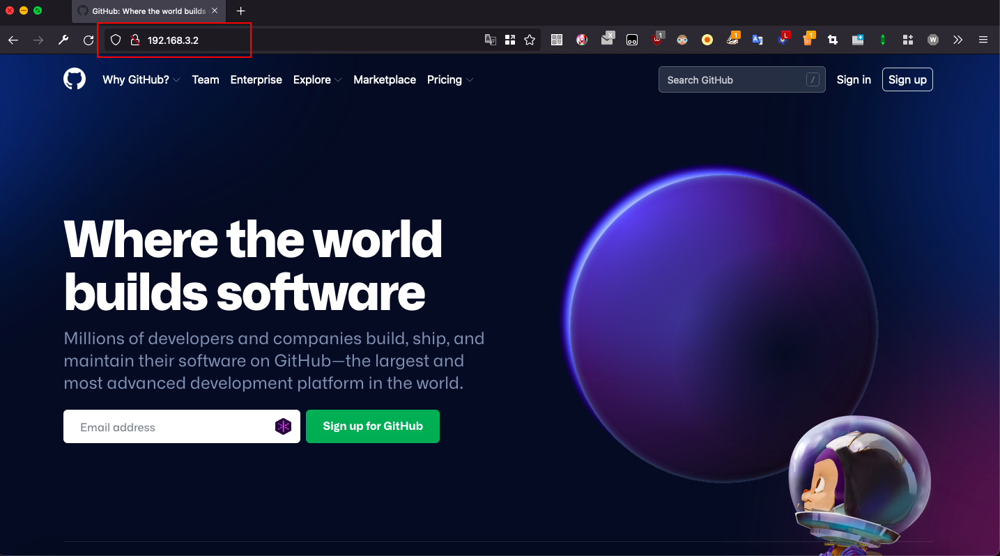

中文简体 | [English](README_en-US.md)

[](https://github.com/axetroy/forward-cli/actions)
[](https://goreportcard.com/report/github.com/axetroy/forward-cli)


## forward-cli

一个命令行工具，反向代理任何网站。例如 Github/Google/Facebook 和其他等. [更多信息](https://github.com/axetroy/blog/issues/634)



### 使用

```bash
forward - A command line tool to quickly setup a reverse proxy server.

USAGE:
  forward [OPTIONS] [host]

OPTIONS:
  --help                              print help information
  --version                           show version information
  --address="<string>"                specify the address that the proxy server listens on. defaults: 0.0.0.0
  --port="<int>"                      specify the port that the proxy server listens on. defaults: 80
  --proxy-external                    whether to proxy external host. defaults: false
  --proxy-external-ignore=<host>      specify the external host without using a proxy. defaults: ""
  --req-header="key=value"            specify the request header attached to the request. Allow multiple flags. defaults: ""
  --res-header="key=value"            specify the response headers. Allow multiple flags. defaults: ""
  --cors                              whether enable cors. defaults: false
  --overwrite=<folder>                enable overwrite with a folder. defaults: ""
  --no-cache                          disabled cache for response. defaults: true
  --tls-cert-file=<filepath>          the cert file path for enabled tls. defaults: ""
  --tls-key-file=<filepath>           the key file path for enabled tls. defaults: ""

EXAMPLES:
  forward http://example.com
  forward --port=80 http://example.com
  forward --req-header="foo=bar" http://example.com
  forward --cors --req-header="foo=bar" --req-header="hello=world" http://example.com
  forward --tls-cert-file=/path/to/cert/file --tls-key-file=/path/to/key/file http://example.com
```

### 安装

1. [Cask](https://github.com/axetroy/cask.rs)

   ```bash
   cask install github.com/axetroy/forward-cli
   ```

2. Shell (Mac/Linux)

   ```bash
   curl -fsSL https://github.com/release-lab/install/raw/v1/install.sh | bash -s -- -r=axetroy/forward-cli -e=forward
   ```

3. PowerShell (Windows):

   ```powershell
   $r="axetroy/forward-cli";$e="forward";iwr https://github.com/release-lab/install/raw/v1/install.ps1 -useb | iex
   ```

4. [Github release page](https://github.com/axetroy/forward-cli/releases) (全平台)

   下载可执行文件，然后放到 `$PATH` 目录下

5. 使用 [Golang](https://golang.org) 从源码中构建并安装 (全平台)

   ```bash
   go install github.com/axetroy/forward-cli/cmd/forward@latest
   ```

### 杂项

1. 如何启用 HTTPS？

要启用 HTTPS，首先先生成 key 和 证书文件

```bash
# 生成 key
openssl genrsa -out server.key 2048
# 生成证书
openssl req -new -x509 -sha256 -key server.key -out server.pem -days 3650
# 启动代理服务器
forward --tls-cert-file=server.pem --tls-key-file=server.key http://example.com
```

2. 自定义代理请求

```bash
# 代理 https://github.com
forward https://github.com
# 发起请求
curl http://0.0.0.0:80/api # 实际请求 https://github.com/api
# 发起自定义代理
curl -H "X-Proxy-Target: https://www.google.com" http://0.0.0.0/api # 实际请求 https://www.google.com/api
```

### 开源许可

The [MIT License](LICENSE)
